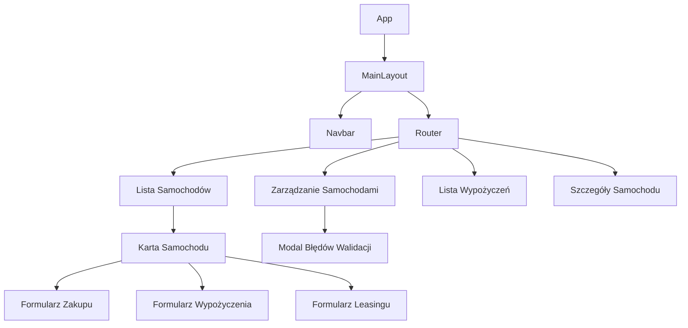

# Dokumentacja Systemu Wypożyczalni Samochodów

## Architektura Systemu



## Szczegóły Komponentów

### Komponenty Główne
1. **App.js**
   - Komponent główny
   - Implementacja routingu z chronionymi ścieżkami
   - Obsługa AuthProvider

2. **MainLayout**
   - Główny układ z nawigacją
   - Obsługa chronionych ścieżek bazująca na roli użytkownika
   - Props: {user: UserType}

3. **CarList**
   - Wyświetlanie dostępnych samochodów z filtrowaniem
   - Stan: {cars: Car[], filters: FilterType}
   - API: GET /cars

### Formularze i Walidacja

1. **LoginForm**
   - Walidacja nazwy użytkownika/hasła
   - API: POST /login
   - Zasady walidacji:
     - Nazwa użytkownika: min 3 znaki
     - Hasło: min 6 znaków

2. **RegisterForm**
   - Rejestracja nowego użytkownika
   - API: POST /register
   - Walidacja:
     - Nazwa użytkownika: unikalna, min 3 znaki
     - Hasło: min 6 znaków
     - Imię/Nazwisko: wymagane

3. **CarManagement Form**
   - Operacje CRUD na samochodach
   - Zasady walidacji:
     - Marka/Model: wymagane
     - Rok: między 1886 a bieżącym rokiem
     - VIN: 17 znaków alfanumerycznych
     - Cena/Moc: liczby dodatnie
   - Endpointy API:
     - POST /cars (dodawanie)
     - PUT /cars/:id (aktualizacja)
     - DELETE /cars/:id (usuwanie)

## Kluczowe Funkcjonalności

### 1. Struktury Danych
- Złożone obiekty: Car, User, Rental
- Typy:
  ```typescript
  Car {
    id: number
    brand: string
    model: string
    year: number
    vin: string
    price: number
    horsePower: number
    isAvailableForRent: boolean
  }

  User {
    id: number
    username: string
    firstName: string
    lastName: string
    isDealer: boolean
  }
  ```

### 2. Filtrowanie i Sortowanie
- Lokalizacja: Komponent CarList
- Funkcje:
  - Wyszukiwanie po marce
  - Filtr zakresu cen
  - Filtr roku produkcji
  - Filtr dostępności
  - Implementacja w funkcji `filteredCars`

### 3. Weryfikacja Typów
- Implementacja PropTypes we wszystkich komponentach
- Przykład z CarCard:
  ```javascript
  CarCard.propTypes = {
    car: PropTypes.shape({
      brand: PropTypes.string.isRequired,
      model: PropTypes.string.isRequired,
      year: PropTypes.number.isRequired,
      price: PropTypes.number.isRequired,
      horsePower: PropTypes.number.isRequired
    }).isRequired
  }
  ```

### 4. Typy Komponentów
- Prezentacyjne:
  - CarCard: Wyświetla informacje o samochodzie
  - ValidationErrorModal: Wielokrotnego użytku do wyświetlania błędów
  - Navbar: Interfejs nawigacji

- Kontenerowe:
  - CarList: Zarządza danymi i filtrowaniem samochodów
  - CarManagement: Obsługuje operacje CRUD

### 5. Komunikacja Dwukierunkowa
- Rodzic-Dziecko:
  - CarList ↔ CarCard: Aktualizacja stanu samochodu
  - CarManagement ↔ ValidationErrorModal: Obsługa błędów

- Kontekst:
  - AuthContext: Zarządza stanem uwierzytelnienia
  - Używany w: LoginForm, RegisterForm, Navbar

### 6. Komponenty Wielokrotnego Użytku
- ValidationErrorModal
  - Używany w: CarManagement, RegisterForm
  - Props: {errors: string[], onClose: () => void}

- CarCard
  - Używany w: CarList, CarManagement
  - Props: {car: Car, onUpdate: () => void}

### 7. Walidacja Formularzy
- Walidacja po stronie klienta:
  - LoginForm: Sprawdzanie danych logowania
  - RegisterForm: Walidacja danych użytkownika
  - CarManagement: Walidacja danych samochodu

- Walidacja po stronie serwera:
  - Middleware express-validator
  - Sanityzacja danych wejściowych
  - Walidacja logiki biznesowej

### 8. Operacje HTTP i Routing
- Endpointy REST API:
  ```
  GET    /cars
  POST   /cars
  PUT    /cars/:id
  DELETE /cars/:id
  POST   /cars/:id/rent
  POST   /cars/:id/buy
  ```

- Chronione ścieżki:
  ```javascript
  <Route path="/manage-cars" element={
    <PrivateRoute element={<CarManagement />} requiredRole="isDealer" />
  } />
  ```

## Instrukcja Użytkownika

### Operacje Dealera
1. Logowanie jako dealer
2. Przejście do "Zarządzanie Samochodami"
3. Dodawanie nowego samochodu:
   - Wypełnienie wymaganych pól
   - Zatwierdzenie formularza
4. Edycja/Usuwanie samochodów:
   - Użycie przycisków akcji w liście
   - Błędy walidacji pokazywane w modalu

### Operacje Klienta
1. Przeglądanie samochodów:
   - Użycie filtrów do zawężenia wyników
   - Przeglądanie szczegółów
2. Wypożyczenie/Zakup samochodu:
   - Wybór samochodu
   - Wybór opcji wypożyczenia/zakupu
   - Wypełnienie formularza transakcji
3. Przeglądanie wypożyczeń:
   - Przejście do "Moje Wypożyczenia"
   - Przegląd aktywnych wypożyczeń
   - Zwrot samochodów

### Funkcje Bezpieczeństwa
- Uwierzytelnianie oparte na sesjach
- Kontrola dostępu bazująca na rolach
- Chronione endpointy API
- Walidacja i sanityzacja danych wejściowych

## Przykłady Odpowiedzi API

### Dodanie Samochodu
```json
POST /cars
{
  "brand": "Toyota",
  "model": "Camry",
  "year": 2023,
  "vin": "1HGCM82633A123456",
  "price": 25000,
  "horsePower": 203
}
```

### Utworzenie Wypożyczenia
```json
POST /rentals
{
  "carId": 1,
  "startDate": "2024-01-23",
  "endDate": "2024-01-30"
}
```
